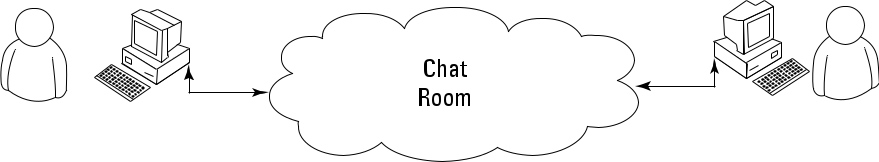

---
layout:
  title:
    visible: true
  description:
    visible: false
  tableOfContents:
    visible: true
  outline:
    visible: true
  pagination:
    visible: true
---

# Talking to Your Computer

## Talking to Your Computer 

Talking to a machine may seem quite odd at first, but it’s necessary because a computer can’t read your mind — yet. Even if the computer did read your mind, it would still be communicating with you. Nothing can occur without an exchange of information between the machine and you. Activities such as

* Reading your email
* Writing about your vacation
* Finding the greatest gift in the world

are all examples of communication that occurs between a computer and you. That the computer further communicates with other machines or people to address requests that you make.

In most cases, the communication takes place in a manner that is nearly invisible to you unless you really think about it. For example, when you visit a chat room online, you might think that you’re communicating with another person. However, you’re communicating with your computer, your computer is communicating with the other person’s computer through the chat room (whatever it consists of), and the other person’s computer is communicating with that person. Figure gives you an idea of what is actually taking place.

<figure><figcaption></figcaption></figure>

Notice the cloud in the center of the Figure. The cloud could contain anything, but you know that it at least contains other computers running other applications. These computers make it possible for your friend and you to chat. Now, think about how easy the whole process seems when you’re using the chat application. Even though all these things are going on in the background, it seems as if you’re simply chatting with your friend and the process itself is invisible.

## Knowing that an Application is a Form of Communication 

Computer communication occurs through the use of applications. You use one application to answer your email, another to purchase goods, and still another to create a presentation. An application (sometimes called an app) provides the means to express human ideas to the computer in a manner the computer can understand and defines the tools needed to shape the data used for communication in specific ways. Data used to express the content of a presentation is different from data used to purchase a present for your mother. The way you view, use and understand the data is different for each task, so you must use different applications to interact with the data in a manner that both the computer and you can understand.

It’s possible to obtain applications to meet just about any general need you can conceive of today. In fact, you probably have access to applications for which you haven’t even thought about a purpose yet. Programmers have been busy creating millions of applications of all types for many years now, so it may be hard to understand what you can accomplish by creating some new method for talking with your computer through an application. The answer comes down to thinking about the data and how you want to interact with it. Some data simply isn’t common enough to have attracted the attention of a programmer, or you may need the data in a format that no application currently supports, so you don’t have any way to tell the computer about it unless you create a custom application to do it.

The following sections describe applications from the perspective of working with unique data in a manner that is special in some way. For example, you might have access to a video library database but no method to access it in a way that makes sense to you. The data is unique and your access needs are special, so you may want to create an application that addresses both the data and your needs.

### Thinking about procedures you use daily 

A procedure is simply a set of steps you follow to perform a task. For example, when making toast, you might use a procedure like this:

1. Get the bread and butter from the refrigerator.
2. Open the bread bag and take out two pieces of toast.
3. Remove the cover from the toaster.
4. Place each piece of bread in its own slot.
5. Push the toaster lever down to start toasting the bread.
6. Wait for the toasting process to complete.
7. Remove toast from the toaster.
8. Place toast on a plate.
9. Butter the toast.

Your procedure might vary from the one presented here, but it’s unlikely that you’d butter the toast before placing it in the toaster. Most people never actually think about the procedure for making toast. However, you use a procedure like this one even though you don’t think about it.

Computers can’t perform tasks without a procedure. You must tell the computer which steps to perform, the order in which to perform them, and any exceptions to the rule that could cause failure. All this information (and more) appears within an application. In short, an application is simply a written procedure that you use to tell the computer what to do, when to do it, and how to do it. Because you’ve been using procedures all your life, all you really need to do is apply the knowledge you already possess to what a computer needs to know about specific tasks.

### Writing procedures down 

Many experiences in life revolve around procedures. Think about the check-list used by pilots before a plane takes off. Without a good procedure, the plane could crash. Learning to write a great procedure takes time, but it’s doable. You may have to try several times before you get a procedure that works completely, but eventually, you can create one. Writing procedures down isn’t really sufficient, though — you also need to test the procedure by using someone who isn’t familiar with the task involved. When working with computers, the computer is your perfect test subject.

### Seeing applications as being like any other procedure 

When you write an application, you’re writing a procedure that defines a series of steps that the computer should perform to accomplish whatever task you have in mind. If you leave out a step, the results won’t be what you expected. The computer won’t know what you mean or that you intended for it to perform certain tasks automatically. The only thing the computer knows is that you have provided it with a specific procedure and it needs to perform that procedure.

### Understanding that computers take things literally 

People eventually get used to the procedures you create. They automatically compensate for deficiencies in your procedure or make notes about things that you left out. In other words, people compensate for problems with the procedures that you write.

When you begin writing computer programs, you’ll get frustrated because computers perform tasks precisely and read your instructions literally. For example, if you tell the computer that a certain value should equal 5, the computer will look for a value of exactly 5. A human might see 4.9 and know that the value is good enough, but a computer doesn’t see things that way. It sees a value of 4.9 and decides that it doesn’t equal 5 exactly. In short, computers are inflexible, unintuitive, and unimaginative. When you write a procedure for a computer, the computer will do precisely as you ask absolutely every time and never modify your procedure or decide that you really meant for it to do something else.

## Defining What an Application Is 

As previously mentioned, applications provide the means to define and express human ideas in a manner that a computer can understand. To accomplish this goal, the application relies on one or more procedures that tell the computer how to perform the tasks related to the manipulation of data and its presentation. What you see onscreen is the text from your word processor, but to see that information, the computer requires procedures for retrieving the data from disk, putting it into a form you can understand, and then presenting it to you. The following sections define the specifics of an application in more detail.

### Understanding that computers use a special language 

Human language is complex and difficult to understand. Even applications such as Alexa or Google Assistant have serious limits in understanding what you’re saying. Over the years, computers have gained the capability to input human speech as data and to understand certain spoken words as commands, but computers still don’t quite understand human speech to any significant degree.

Given what you know from previous sections of this chapter, computers could never rely on human speech to understand the procedures you write. Computers always take things literally, so you’d end up with completely unpredictable results if you were to use human language to write applications. That’s why humans use special languages, called programming languages, to communicate with computers. These special languages make it possible to write procedures that are both specific and completely understandable by both humans and computers.

> Computers don’t actually speak any language. They use binary codes to flip switches internally

&#x20;and to perform math calculations. Computers don’t even understand letters, they only understand numbers. A special application turns the computer-specific language you use to write a procedure into binary codes. For the purposes of this book, you really don’t need to worry too much about the low-level specifics of how computers work at the binary level. However, it’s interesting to know that computers speak math and numbers, not really a language at all.

### Helping humans speak to the computer 

It’s important to keep the purpose of an application in mind as you write it. An application is there to help humans speak to the computer in a certain way. Every application works with some type of data that is input, stored, manipulated, and output so that the humans using the application obtain the desired result. Whether the application is a game or a spreadsheet, the basic idea is the same. Computers work with data provided by humans to obtain the desired result.

When you create an application, you’re providing a new method for humans to speak to the computer. The new approach you create will make it possible for other humans to view data in new ways. The communication between humans and computer should be easy enough that the application actually disappears from view. Think about the kinds of applications you’ve used in the past. The best applications are the ones that let you focus on whatever data you’re interacting with. For example, a game application is considered immersive only if you can focus on the planet you’re trying to save or the ship you’re trying to fly, rather than the application that lets you do these things.

One of the best ways to start thinking about how you want to create an application is to look at the way other people create applications. Writing down what you like and dislike about other applications is a useful way to start discovering how you want your applications to look and work. Here are some questions you can ask yourself as you work with the applications:

* What do I find distracting about the application?
* Which features were easy to use?
* Which features were hard to use?
* How did the application make it easy to interact with my data?
* How would I make the data easier to work with?
* What do I hope to achieve with my application that this application doesn’t provide?

Professional developers ask many other questions as part of creating an application, but these are good starter questions because they begin to help you think about applications as a means to help humans speak with computers. If you’ve ever found yourself frustrated by an application you used, you already know how other people will feel if you don’t ask the appropriate questions when you create your application. Communication is the most important element of any application you create.

When you decide to create an application, make sure that you know why you’re creating it and what you hope to achieve. Just having a plan in place really helps make programming fun. You can work on your new application and see your goals accomplished one at a time until you have a completed application to use and show off to your friends (all of whom will think you’re really cool for creating it).

## How the Internet works 

The Internet is the backbone of the Web, the technical infrastructure that makes the Web possible. At its most basic, the Internet is a large network of computers which communicate all together.

The history of the Internet is somewhat obscure. It began in the 1960s as a US-army-funded research project, then evolved into a public infrastructure in the 1980s with the support of many public universities and private companies. The various technologies that support the Internet have evolved over time, but the way it works hasn't changed that much: the Internet is a way to connect computers all together and ensure that, whatever happens, they find a way to stay connected.

A website consists of a bunch of files saved on a hard disk -- just like your movies, music, or pictures. However, there is one part that is unique for websites: they include computer code called HTML.

If you're not familiar with programming, it can be hard to grasp HTML at first, but your web browsers (like Chrome, Safari, Firefox, etc.) love it. Web browsers are designed to understand this code, follow its instructions, and present these files that your website is made of, exactly the way you want.

As with every file, we need to store HTML files somewhere on a hard disk. For the Internet, we use special, powerful computers called servers. They don't have a screen, mouse or a keyboard, because their main purpose is to store data and serve it. That's why they're called servers – because they serve you data.

In fact it is a network of connected machines (the above-mentioned servers). Hundreds of thousands of machines! Many, many kilometers of cables around the world! You can visit a Submarine Cable Map website ([http://submarinecablemap.com](https://www.google.com/url?q=http://submarinecablemap.com\&sa=D\&source=editors\&ust=1694503000506509\&usg=AOvVaw1RkvliUoNb1eAs9AETHtBR)) to see how complicated the net is. Here is a screenshot from the website:

<figure><figcaption></figcaption></figure>

It is not possible to have a wire between every machine connected to the Internet. So, to reach a machine (for example, the one where https://prospello.in is saved) we need to pass a request through many, many different machines.

Imagine that when you type https://prospello.in, you send a letter that says: "Dear Internet, I want to see the prospello.in website. Send it to me, please!"

Your letter goes to the post office closest to you. Then it goes to another that is a bit nearer to your addressee, then to another, and another until it is delivered at its destination. The only unique thing is that if you send many letters (data packets) to the same place, they could go through totally different post offices (routers). This depends on how they are distributed at each office.

That's how it works - you send messages and you expect some response. Instead of paper and pen you use bytes of data, but the idea is the same!

Instead of addresses with a street name, city, zip code and country name, we use IP addresses. Your computer first asks the DNS (Domain Name System) to translate djangoboys.org into an IP address. It works a little bit like old-fashioned phone books where you can look up the name of the person you want to contact and find their phone number and address.

When you send a letter, it needs to have certain features to be delivered correctly: an address, a stamp, etc. You also use a language that the receiver understands, right? The same applies to the data packets you send to see a website. We use a protocol called HTTP (Hypertext Transfer Protocol).

So, basically, when you have a website, you need to have a server (machine) where it lives. When the server receives an incoming request (in a letter), it sends back your website (in another letter).
