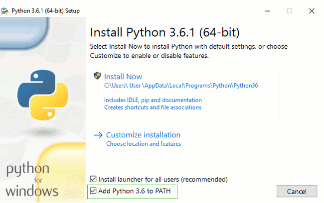

# Introduction to Python

## Understanding Why Python is So Cool 

Many programming languages are available today. In fact, a student can spend an entire semester in college studying computer languages and still not hear about them all.

Programmers keep creating new languages for good reason. Each language has something special to offer — something it does exceptionally well. In addition, as computer technology evolves, so do the programming languages in order to keep up. Because creating an application is all about efficient communication, many programmers know multiple programming languages so that they can choose just the right language for a particular task. One language might work better to obtain data from a database, and another might create user interface elements especially well.

As with every other programming language, Python does some things exceptionally well, and you need to know what they are before you begin using it. You might be amazed by the really cool things you can do with Python. Knowing a programming language’s strengths and weaknesses helps you use it better as well as avoid frustration by not using the language for things it doesn’t do well. The following sections help you make these sorts of decisions about Python.

### Unearthing the reasons for using Python 

Most programming languages are created with specific goals in mind. These goals help define the language characteristics and determine what you can do with the language. There really isn’t any way to create a programming ­language that does everything because people have competing goals and needs when creating applications. When it comes to Python, the main objective was to create a programming language that would make programmers efficient and productive. With that in mind, here are the reasons that you want to use Python when creating an application:

* Less application development time: Python code is usually 2–10 times shorter than comparable code written in languages like C/C++ and Java, which means that you spend less time writing your application and more time using it.
* Ease of reading: A programming language is like any other language — you need to be able to read it to understand what it does. Python code tends to be easier to read than the code written in other languages, which means you spend less time interpreting it and more time making essential changes.

> Python is the most popular language as of October 2021 as per TIOBE (https://www.tiobe.com/tiobe-index/). Python, which started as a simple scripting language, as an alternative to Perl, has become mature. Its ease of learning, its huge amount of libraries, and its widespread use in all kinds of domains, has made it the most popular programming language of today.

### What makes Python the “Best of the Best?” 

Here are some of the most noteworthy features of Python that make it an excellent tool for professionals of all skill levels:

#### Python = Simplicity

Python is not only easy to learn but also easy to use and implement. With a syntax similar to English, you can master Python coding in a few days. Moreover, Python is dynamically-typed, which makes indentation mandatory, thereby enhancing its readability factor.

#### It is an open-source language

You don’t need to pay charges to install and use Python – it is open-source. What this means is that the source code of Python is freely available to the public. You can download it from Python’s official website. Not only that, Python supports the FLOSS (Free/Libre and Open Source Software) model, which means you can also change it and distribute it. This allows the Python community to tweak it and improve its features continuously.

#### It is a high-level language

Since Python is a high-level language, you need not remember its system architecture, nor do you need to perform memory management. This feature contributes to Python’s user friendliness.

#### It is interpreted

Unlike compiled languages like C++ and Java wherein you must compile the code and then run it, Python is an interpreted language. What this means is that instead of executing the source code all at once, Python executes it line by line. This makes it easier to debug a Python code because you can do it while writing the code.

#### It is both object-oriented and functional

An object-oriented programming language is one that can model real-world data, while a functional language focuses on functions (code that can be reused). Python supports both object-oriented and functional programming features. Also, unlike Java, Python supports multiple inheritances.

#### It is portable

Python is portable and highly flexible, meaning, a Python code written for a Windows machine or a Linux machine can also run on iOS, and vice versa – you don’t need to make any alterations in the code. So, Python eliminates the need to write different code for different machines (just make sure there’s no system-dependent feature in your Python code).

#### It is extensible and embeddable

Python is an extensible language, as it allows you to write specific parts of your Python code in other programming languages such as C++. Similarly, you can also embed your Python code in the source code of other languages. This allows you to integrate Python’s scripting functionalities into a code written in another language.

#### It comes with a vast collection of libraries

When you download Python, you will automatically download the extensive collection of Python libraries with it. These libraries are built-in, so you don’t have to write individual code for every single thing. Python has libraries and packages for web browsers, threading, databases, regular expressions, image manipulation, documentation generation, unit-testing, CGI, email, and much more

### 12 Real-world Applications of Python 

#### 1. Web Development

Python offers numerous options for web development. For instance, you have Django, Pyramid, Flask, and Bottle for developing web frameworks and even advanced content management systems like Plone and Django CMS. These web frameworks are packed with standard libraries and modules which simplify tasks like content management, database interaction, and interfacing with internet protocols like HTTP, SMTP, XML, JSON, FTP, IMAP, and POP.

Python web frameworks are known for their security, scalability, and flexibility. To add to that, Python’s Package Index comes with useful libraries like Requests, BeautifulSoup, Paramiko, Feedparser, and Twisted Python.

#### 2. Game Development

As we mentioned earlier, Python comes loaded with many useful extensions (libraries) that come in handy for the development of interactive games. For instance, libraries like PySoy (a 3D game engine that supports Python 3) and PyGame are two Python-based libraries used widely for game development. Python is the foundation for popular games like Battlefield 2, Frets on Fire, World of Tanks, Disney’s Toontown Online, Vega Strike, and Civilization-IV.

Apart from game development, game designers can also use Python for developing tools to simplify specific actions such as level design or dialog tree creation, and even use those tools to export those tasks in formats that can be used by the primary game engine. Also, Python is used as a scripting language by many game engines.

#### 3. Scientific and Numeric Applications

Thanks to its massive library base, Python has become a crucial tool in scientific and numeric computing. In fact, Python provides the skeleton for applications that deal with computation and scientific data processing. Apps like FreeCAD (3D modeling software) and Abaqus (finite element method software) are coded in Python.

Some of the most useful Python packages for scientific and numeric computation include:

* SciPy (scientific numeric library)
* Pandas (data analytics library)
* IPython (command shell)
* Numeric Python (fundamental numeric package)
* Natural Language Toolkit (Mathematical And text analysis)

#### 4. Artificial Intelligence and Machine Learning

AI and ML models and projects are inherently different from traditional software models. When we talk about AI/ML projects, the tools and technologies used and the skills required are totally different from those used in the development of conventional software projects. AI/ML applications require a language that is stable, secure, flexible, and is equipped with tools that can handle the various unique requirements of such projects. Python has all these qualities, and hence, it has become one of the most favored languages of Data Science professionals and Python is a must have tool in data science courses.

Python’s simplicity, consistency, platform independence, great collection of resourceful libraries, and an active community make it the perfect tool for developing AI and ML applications. Some of the best Python packages for AI and ML are:

* SciPy for advanced computing
* Pandas for general-purpose data analysis
* Seaborn for data visualization
* Keras, TensorFlow, and Scikit-learn for ML
* NumPy for high-performance scientific computing and data analysis

&#x20;Apart from these libraries, there are also other Python-based libraries like NLTK, Caffee, PyTorch, and Accord.NET, that are useful for AI and ML projects.

#### 5. Desktop GUI

Python not only boasts of an English-like syntax, but it also features a modular architecture and the ability to work on multiple operating systems. These aspects, combined with its rich text processing tools, make Python an excellent choice for developing desktop-based GUI applications.

Python offers many GUI toolkits and frameworks that make desktop application development a breeze. PyQt, PyGtk, Kivy, Tkinter, WxPython, PyGUI, and PySide are some of the best Python-based GUI frameworks that allow developers to create highly functional Graphical User Interfaces (GUIs).

#### 6. Software Development

Python packages and applications aim to simplify the process of software development. From developing complex applications that involve scientific and numeric computing to developing desktop and web applications, Python can do it all. This is the reason why Software Developers use Python as a support language for build control, testing, and management.

For instance, SCons is designed explicitly for build control, Buildbot and Apache Gump allow for automated continuous compilation and testing, and Roundup and Trac are great for bug tracking and project management.

Python also supports data analyzation and visualization, thereby further simplifying the process of creating custom solutions minus the extra effort and time investment.

#### 7. Enterprise-level/Business Applications

Enterprise-level software or business applications are strikingly different from standard applications, as the former demands features like readability, extensibility, and scalability. Essentially, business applications are designed to fit the requirements of an organization rather than the needs of individual customers.

Thus, these applications must be capable of integrating with legacy systems like existing databases and non-web apps. Since business applications are developed, keeping in mind the custom requirements to cater to the specific needs of an organization’s operating model, the entire development process becomes very complicated.

This is where Python can make a significant difference. Python high performance, scalability, flexibility, and readability are just the features required for developing fully-functional and efficient business applications. Furthermore, Python has other tools for business application development, like:

* Odoo, an all-in-one management software that forms a complete suite of enterprise management applications.
* Tryton, a three-tier, high-level, general-purpose application platform, is another fantastic tool for building business applications.

#### 8. Education programs and training courses

Python has an extremely straightforward syntax that’s similar to the English language. It has a short learning curve and hence, is an excellent choice for beginners. Python’s easy learning curve and simplicity are the two main reasons why it is one of the most used programming languages in educational programs, both at beginner and advanced levels.

However, Python is not just great as an introductory language – even professional developers and coders all around the world rely heavily on Python.

#### 9. Language Development

Over the years, Python’s design and module architecture has been the inspiration behind the development of many new programming languages such as Boo, Swift, CoffeeScript, Cobra, and OCaml. All of these languages share numerous similarities with Python on grounds like object model, syntax, and indentation.

#### 10. Operating Systems

Python is the secret ingredient behind many operating systems as well, most popularly of Linux distributions. Linux-based Ubuntu’s Ubiquity Installer and Fedora and RedHat Enterprise’s Anaconda Installer are coded in Python. Even Gentoo Linux leverages Python Portage (package management system). Usually, Python is combined with the C programming language to design and develop operating systems.

#### 11. Web Scraping Applications

Python is a nifty tool for extracting voluminous amounts of data from websites and web pages. The pulled data is generally used in different real-world processes, including job listings, price comparison, R\&D, etc.

BeautifulSoup, MechanicalSoup, Scrapy, LXML, Python Requests, Selenium, and Urllib are some of the best Python-based web scraping tools.

#### 12. Image Processing and Graphic Design Applications:

Alongside all the uses mentioned above, Python also finds a unique use case in image processing and graphic design applications. The programming language is used globally to design and build 2D imaging software like Inkscape, GIMP, Paint Shop Pro, and Scribus. Also, Python is used in several 3D animation packages such as Blender, Houdini, 3ds Max, Maya, Cinema 4D, and Lightwave, to name a few.

### Discovering which organizations use Python 

Python really is quite good at the tasks that it was designed to perform. In fact, that’s why a lot of large organizations use Python to perform at least some application-creation (development) tasks. You want a programming language that has good support from these large organizations because these organizations tend to spend money to make the language better.

Python is used by Intel, IBM, NASA, Pixar, Netflix, Facebook, JP Morgan Chase, Spotify, and a number of other massive companies. It’s one of the four main languages at Google, while Google's YouTube is largely written in Python. Same with Reddit, Pinterest, and Instagram. The original BitTorrent client was also written in Python. And it is used as a scripting language to control Maya, the industry-standard 3D modeling and animation tool.

Google has backed Python from almost the very beginning. Early on, the founders of Google decided to use Python whenever they could and only use C++ where they couldn’t use Python. So C++ was used where memory control was imperative and low latency was desired. For everything else, Python enabled ease of maintenance and relatively fast delivery.

Facebook loves Python because the ease of using its libraries means that production engineers don’t have to write or maintain as much code, freeing them to focus on getting improvements live. Also, it ensures that Facebook’s infrastructure scales efficiently.

Netflix Engineers have cheered Python’s standard library, the extremely active development community, and the rich variety of third-party libraries available to solve nearly any given problem. Additionally, because Python is so easy to develop, it has become a linchpin in many of Netflix’s other services.

Finally, because many of Dropbox’s libraries and internals are proprietary and not open source, the company has released a very efficient API coded in Python that allows you to see how their engineers are thinking. Interviews with Dropbox Engineers have indicated that a huge percentage of their server-side code is Python.

Python, however, isn’t only sought after in specific companies, there are entire industries that rely on the use of Python. Astronomy, social science, AI, and the Internet of Things are examples of fields that have multiple roles that rely on Python.


You can find a more complete list of organizations at [http://www.python.org/about/success/](https://www.google.com/url?q=http://www.python.org/about/success/\&sa=D\&source=editors\&ust=1694503000527948\&usg=AOvVaw0rEBl8ixo8d3WLtJ-gO7Ec). The number of success stories has become so large that even this list probably isn’t complete and the people supporting it have had to create categories to better organize it.


> Read [10 Myths of Enterprise Python](https://www.google.com/url?q=https://medium.com/paypal-tech/10-myths-of-enterprise-python-8302b8f21f82\&sa=D\&source=editors\&ust=1694503000528599\&usg=AOvVaw3Y8GShoe9xcVzwVT6E5pVd) Article from The PayPal Technology Blog on Medium

## Python installation 

Every platform (a combination of computer hardware and operating system software) has special rules that it follows when running applications. The Python application hides these details from you. You type code that runs on any platform that Python supports, and the Python applications translate that code into something the platform can understand. However, in order for the translation to take place, you must have a version of Python that works on your particular platform

### Installing Python in Windows 

First check whether your computer is running a 32-bit version or a 64-bit version of Windows, on the "System type" line of the System Info page. To reach this page, try one of these methods:

1. Press the Windows key and Pause/Break key at the same time
2. Open your Control Panel from the Windows menu, then navigate to System & Security, then System
3. Press the Windows button, then navigate to Settings > System > About
4. Search the Windows Start menu for "System Information". To do that, click the Start button or press the Windows key, then begin to type System Information. It will start making suggestions as soon as you type. You can select the entry once it shows up.

You can download Python for Windows from the website[https://www.python.org/downloads/windows/](https://www.google.com/url?q=https://www.python.org/downloads/windows/\&sa=D\&source=editors\&ust=1694503000530259\&usg=AOvVaw3Ll7xLJOnkUPqTLZftGKwp). Click on the "Latest Python 3 Release - Python x.x.x" link. If your computer is running a 64-bit version of Windows, download the Windows x86-64 executable installer. Otherwise, download the Windows x86 executable installer. After downloading the installer, you should run it (double-click on it) and follow the instructions there.

One thing to watch out for: During the installation, you will notice a window marked "Setup". Make sure you tick the "Add Python 3.8 to PATH" or 'Add Python to your environment variables" checkbox and click on "Install Now", as shown here (it may look a bit different if you are installing a different version):

<figure><figcaption></figcaption></figure>

When the installation completes, you may see a dialog box with a link you can follow to learn more about Python or about the version you installed. Close or cancel that dialog -- you'll be learning more in this tutorial!

Note: If you are using an older version of Windows (7, Vista, or any older version) and the Python 3.8 installer fails with an error, then install all Windows Updates and try to install Python again

### Installing Python in OS X 

You need to go to the website [https://www.python.org/downloads/mac-osx/](https://www.google.com/url?q=https://www.python.org/downloads/mac-osx/\&sa=D\&source=editors\&ust=1694503000531485\&usg=AOvVaw1ZNuqvtVnfPzprHSupcqUi) and download the latest Python installer:

1. Download the Mac OS X 64-bit/32-bit installer file,
2. Double-click python-3.8.6-macosx10.9.pkg to run the installer.

> Note: Before you install Python on OS X, you should ensure your Mac settings allow installing

packages that aren't from the App Store. Go to System Preferences (it's in the Applications folder), click "Security & Privacy," and then the "General" tab. If your "Allow apps downloaded from:" is set to "Mac App Store," change it to "Mac App Store and identified developers."

### Installing Python in Linux 

It is very likely that you already have Python installed out of the box. To check if you have it installed (and which version it is), open a console and type the following command:

$ python3 --version\
Python 3.8.6

If python3 is not installed on your system, type this command into your terminal console:

$ sudo apt install python3

If something went wrong and you have no idea what to do next, please ask your coach! Sometimes things don't go smoothly and it's better to ask for help from someone with more experience.

## Code Editors 

You're about to write your first line of code, so it's time to download a code editor!

There are a lot of different editors and it largely boils down to personal preference. Most Python programmers use complex but extremely powerful IDEs (Integrated Development Environments), such as PyCharm. As a beginner, however, that's probably less suitable; our recommendations are equally powerful, but a lot simpler.

Our suggestions are below, but feel free to ask your coach what their preferences are – it'll be easier to get help from them.

### Visual Studio Code 

Visual Studio Code is a source code editor developed by Microsoft for Windows, Linux and macOS. It includes support for debugging, embedded Git control, syntax highlighting, intelligent code completion, snippets, and code refactoring.

[Download it here](https://www.google.com/url?q=https://code.visualstudio.com/\&sa=D\&source=editors\&ust=1694503000535706\&usg=AOvVaw2NbK4TELwFewUObA8oZM\_-)

### Gedit 

Gedit is an open-source, free editor, available for all operating systems.

[Download it here](https://www.google.com/url?q=https://wiki.gnome.org/Apps/Gedit%23Download\&sa=D\&source=editors\&ust=1694503000536249\&usg=AOvVaw1c5Ra\_kEHQUuNztOdASsBd)

### Sublime Text 3 

Sublime Text is a very popular editor with a free evaluation period and it's available for all operating systems.

[Download it here](https://www.google.com/url?q=https://www.sublimetext.com/3\&sa=D\&source=editors\&ust=1694503000536759\&usg=AOvVaw2iA1Q2VQeiqqOPc9OV\_EsC)

### Atom 

Atom is another popular editor. It's free, open-source and available for Windows, OS X and Linux. Atom is developed by [GitHub](https://www.google.com/url?q=https://github.com/\&sa=D\&source=editors\&ust=1694503000537156\&usg=AOvVaw0\_mkg5UoaBc8mvaI1eAzX5).

[Download it here](https://www.google.com/url?q=https://atom.io/\&sa=D\&source=editors\&ust=1694503000537339\&usg=AOvVaw0g2byHxzlSE\_frwKG\_RLa1)

### Why are we installing a code editor? 

You might be wondering why we are installing this special code editor software, rather than using something like Word or Notepad.

The first reason is that code needs to be plain text, and the problem with programs like Word and TextEdit is that they don't actually produce plain text, they produce rich text (with fonts and formatting), using custom formats like [RTF (Rich Text Format)](https://www.google.com/url?q=https://en.wikipedia.org/wiki/Rich\_Text\_Format\&sa=D\&source=editors\&ust=1694503000538105\&usg=AOvVaw0AoBooe-5JFm739VDhqhQm).

The second reason is that code editors are specialized for editing code, so they can provide helpful features like highlighting code with color according to its meaning or automatically closing quotes for you.

We'll see all this in action later. Soon, you'll come to think of your trusty old code editor as one of your favorite tools. :)
